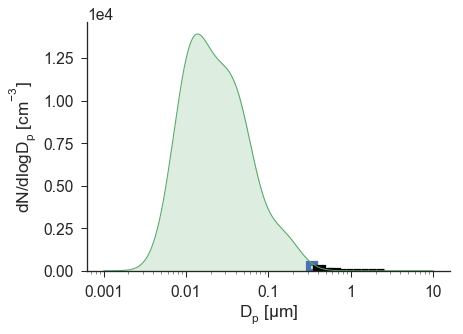

.. _opc_with_dist:

10-Bin OPC Response with Distribution
=====================================

**Python source code:** :download:`[download source: opc_with_dist.py]<opc_with_dist.py>`

.. raw:: html

    

.. literalinclude:: opc_with_dist.py
    :lines: 6-

.. raw:: html

    

